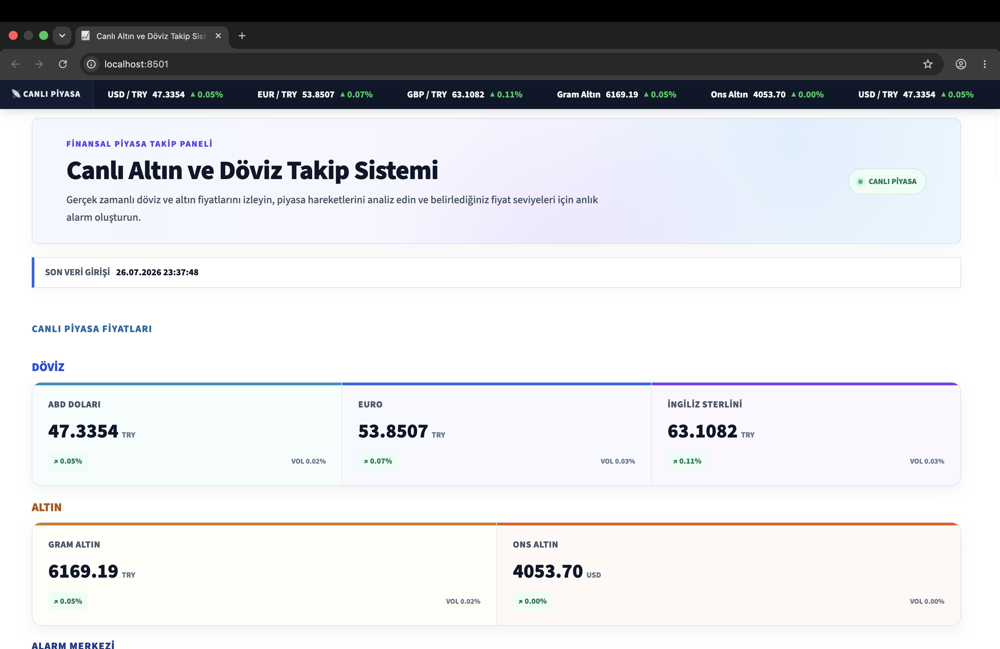

# 📈 Canlı Altın ve Döviz Takip Alarm Sistemi

<p align="center">
    
</p>

Python ve Streamlit kullanılarak geliştirilen bu proje; **USD/TRY, EUR/TRY, GBP/TRY, Ons Altın ve Gram Altın** fiyatlarını gerçek zamanlı olarak takip eden, verileri SQLite veritabanına kaydeden, grafiklerle analiz eden ve kullanıcıya fiyat alarmı oluşturma imkanı sunan bir finans takip sistemidir.

---

# 🚀 Proje Özellikleri

- 📊 Canlı USD/TRY, EUR/TRY ve GBP/TRY takibi
- 🥇 Canlı Ons Altın ve Gram Altın takibi
- 💾 Verilerin SQLite veritabanına otomatik kaydedilmesi
- ⏰ APScheduler ile her 5 dakikada bir otomatik veri güncelleme
- 🔔 İstenilen fiyat seviyeleri için alarm oluşturabilme
- 📜 Alarm geçmişini görüntüleyebilme
- 📈 Plotly ile etkileşimli grafikler
- 📉 Son 24 saatlik değişim analizi
- ⚡ Volatilite analizi
- 📊 Piyasa liderleri analizi
- 📥 Verileri CSV olarak dışa aktarabilme
- 🎨 Modern ve kullanıcı dostu Streamlit arayüzü

---

# 🛠️ Kullanılan Teknolojiler

- Python
- Streamlit
- SQLite
- Pandas
- Plotly
- Requests
- APScheduler

---

# 📂 Proje Yapısı

```text
.
├── api.py
├── analytics.py
├── app.py
├── config.py
├── database.py
├── scheduler.py
├── notification.py
├── requirements.txt
└── market_data.db
```

---

# ⚙️ Kurulum

## Depoyu klonlayın

```bash
git clone https://github.com/oziico/canli-altin-doviz-takip.git
```

## Proje klasörüne girin

```bash
cd canli-altin-doviz-takip
```

## Sanal ortam oluşturun

```bash
python -m venv venv
```

## Sanal ortamı aktif edin

### macOS / Linux

```bash
source venv/bin/activate
```

### Windows

```bash
venv\Scripts\activate
```

## Gerekli kütüphaneleri yükleyin

```bash
pip install -r requirements.txt
```

---

# 🔑 Yapılandırma

`config.py` dosyasında gerekli API bilgilerini tanımlayın.

Örnek:

```python
TWELVE_DATA_API_KEY = "API_KEY"
GOLD_API_URL = "..."
```

---

# ▶️ Scheduler'ı Çalıştırma

```bash
python scheduler.py
```

Scheduler arka planda çalışarak her **5 dakikada bir** yeni piyasa verilerini veritabanına kaydeder ve aktif alarmları kontrol eder.

---

# ▶️ Arayüzü Başlatma

```bash
streamlit run app.py
```

---

# 📊 Dashboard Özellikleri

## 📈 Canlı Piyasa Takibi

- USD/TRY
- EUR/TRY
- GBP/TRY
- Gram Altın
- Ons Altın

---

## 📉 Analizler

- Son 24 saatlik değişim oranı
- Volatilite analizi
- Hareketli ortalama analizi
- Trend analizi
- Piyasa liderleri

---

## 🔔 Alarm Sistemi

- Fiyat alarmı oluşturma
- Aktif alarmları görüntüleme
- Alarm geçmişini görüntüleme
- Alarm tetiklendiğinde bildirim alma

---

# 📸 Uygulama Görselleri

Bu bölüme uygulamanın ekran görüntülerini ekleyebilirsiniz.

Örneğin:

```text
screenshots/dashboard.png
screenshots/alerts.png
screenshots/analytics.png
```

Ardından aşağıdaki gibi gösterebilirsiniz:

```markdown
## Ana Sayfa


## Alarm Sistemi


## Analiz Sayfası


```

---

# 🎯 Proje Amacı

Bu proje, yazılım mühendisliği stajı kapsamında geliştirilmiştir. Amaç; gerçek zamanlı finansal verileri API üzerinden çekmek, verileri veritabanında saklamak, kullanıcıya görsel analizler sunmak ve belirlenen fiyat seviyelerinde alarm oluşturabilen modern bir finans takip sistemi geliştirmektir.

---

# 👩‍💻 Geliştirici

**Özge**

Yazılım Mühendisliği 4. Sınıf Öğrencisi